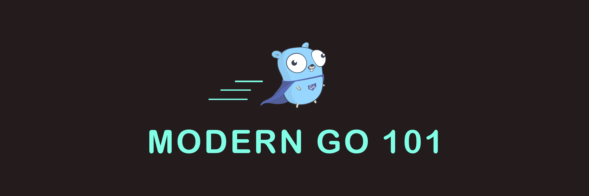

# Modern Go 101

## Welcome to Modern Go 101!

## Introduction

`Modern Go 101` is all about teaching the `Go Programming Language`. This tutorial series is entirely free and available on our YouTube Channel.

This course is intended for people who have some basic programming knowledge and is aimed at intermediate programmers.

`Go` is in a really sweet spot in the programming world, it is statically typed compiled language and is very fast. In addition to this the concurrency model is what makes it more interesting and perhaps easy to use.

In a real world, concurrency is hard! Mutability makes it hard, but `Go` takes a different approach and shares memory by communicating. Many other programming languages suffer because concurrency was an after thought and provide somewhat awkward concurrency models or are mostly single threaded. But concurrency was built into `Go` and it provides primitives such as `goroutines` and `channels` for handling concurrency.

In the battle for concurrency and multi-threaded applications, `Go` certainly ranks very high, but certainly it isn't the only one. Other programming languages such as `Elixir` provide far better concurrency model with its `Actor Model` and are a pure pleasure to work.

`Go` finds wide application from `System Programming` to `Web Applications` and lot of developers use it their everyday jobs. So, let's get going and learn one of the most popular programming language out there.

